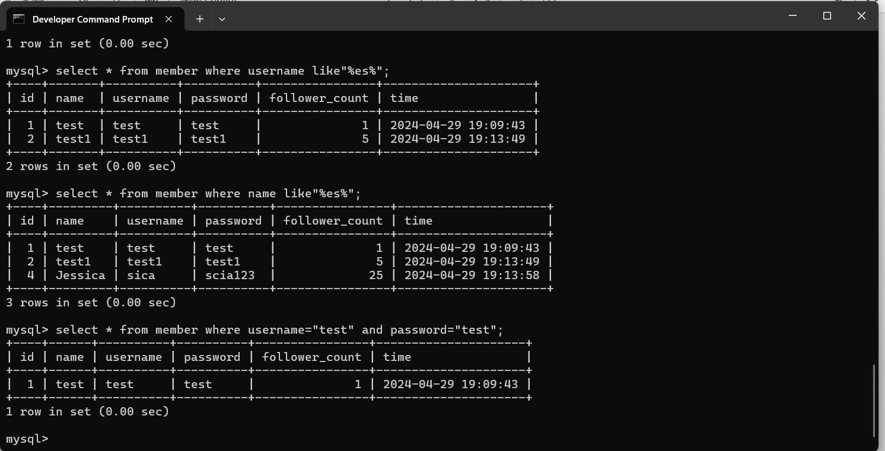

##2.1  
create database website;  
show databases;  
  
##2.2  
use website;  
create table member(id bigint primary key auto_increment,name varchar(255) not null, username varchar(255) not null,password varchar(255) not null,follower_count int unsigned not null default 0,time datetime not null default current_timestamp);  
show tables;  
   
##3.1  
insert into member(name,username,password,follower_count) values("test","test","test",1);  
insert into member(name,username,password,follower_count) values("test1","test1","test1",5);  
insert into member(name,username,password,follower_count) values("John","jjj123","jjj456",15);  
insert into member(name,username,password,follower_count) values("Jessica","sica","scia123",25);  
insert into member(name,username,password,follower_count) values("Yue","beautiful","wonderful",1000);  
   
##3.2  
select * from member;  
   
##3.3  
select * from member order by time desc;  
   
##3.4  
select * from member order by time desc limit 1,3;  
   
##3.5  
select * from member where username="test";  
  
##3.6  
select * from member where name like"%es%";  
  
##3.7  
select * from member where username="test" and password="test";  
  
##3.8  
update member set name="test2" where username="test";  
select * from member;  
  
##4.1  
select count(*) from member;  
  
##4.2  
select sum(follower_count) from member;  
  
##4.3  
select avg(follower_count) from member;  
  
##4.4  
select avg(member_a.follower_count) from (select * from member order by follower_count desc limit 2) as member_a;  
  
##5.1  
create table message(id bigint primary key auto_increment,member_id bigint not null,content varchar(255) not null,like_count int unsigned not null default 0,time datetime not null default current_timestamp,foreign key(member_id) references member(id));  
insert into message(member_id,content,like_count) values(1,"彭彭老師好帥",10);  
insert into message(member_id,content,like_count) values(2,"彭彭老師超棒",11);  
insert into message(member_id,content,like_count) values(3,"彭彭老師賽高",13);  
insert into message(member_id,content,like_count) values(4,"感謝彭彭老師的指導",15);  
insert into message(member_id,content,like_count) values(5,"我老婆好正",1000);  
select * from message;  
  
##5.2  
select member.name,message.* from message inner join member on message.member_id=member.id;  
  
##5.3
select member_a.name,message.* from message inner join (select * from member where username="test") as member_a on message.member_id=member_a.id; 
  
##5.4
select avg(message.like_count) from message inner join (select * from member where username="test") as member_a on message.member_id=member_a.id;
  
##5.5
select avg(message.like_count) from message inner join member on message.member_id=member.id group by member.username;  
  
